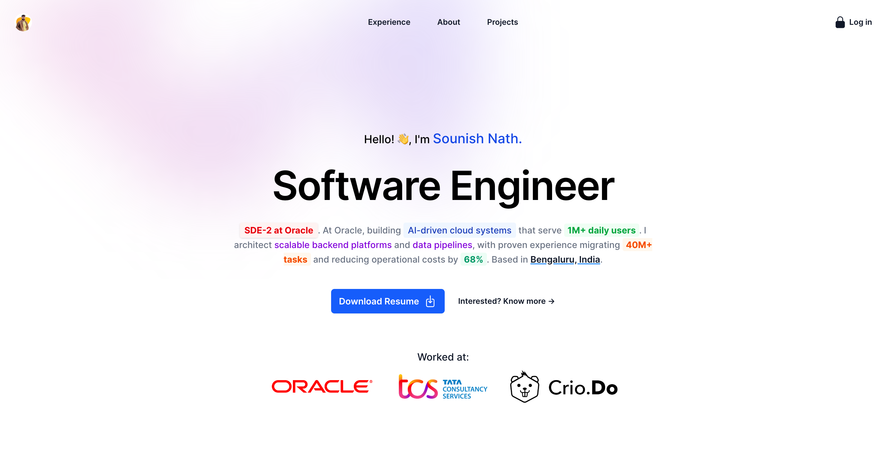

## Sounish Nath | Portfolio

This is my portfolio website, showcasing my skills and projects.

Checkout website : **[Sounish Nath | Portfolio Website](https://sounishnath.netlify.app/)**

**Features:**

* **Responsive design:** The website adapts to different screen sizes, ensuring a seamless experience on all devices.
* **Clean and modern design:** The website has a minimalist and modern design, highlighting my work and skills.
* **Project showcase:** A dedicated section to showcase my projects, with detailed descriptions and links to live demos.
* **Skills section:** A clear overview of my technical skills and expertise.
* **Contact form:** A simple and easy-to-use contact form for potential clients and employers to reach out.
* **Social media links:** Links to my social media profiles for easy access.

**Technologies used:**

* Vue + TypeScript
* TailwindCSS
* Gitub Actions
* Netlify

**Feel free to explore the website and learn more about my work.**
* **[Link to website]**

**Contact me:**

* **[[LinkedIn profile link](https://www.linkedin.com/in/sounishnath/)]**
* **[[GitHub profile link](https://github.com/sounishnath003/)]**
* **[[Twitter profile link](https://x.com/sounish1/)]**

**Design Inspiration**: 
https://rdsx.dev/ - Simple Minimalistic Portfolio. Big thanks to the RDS.

Thank you for visiting!

**Built with ❤️ using 👨‍💻VueJS, 🛠️ Github, 🌎 Netlify ‐
Version: 4.0**

**[Portfolio](https://sounishnath.netlify.app/)**